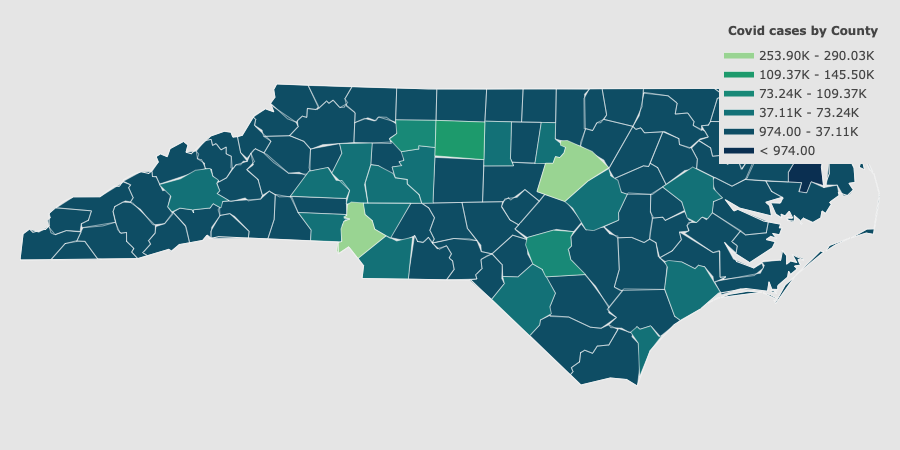

# Covid19_NC

## About

This is a python program that generates a choropleth for the Covid-19 cases in North Carolina.

1. Prerequisites
    - Download and install the latest version of python from: https://www.python.org/downloads/
    - Currently using python 3.9 to run this 

2. Results
    - 

### References

- All statistics are being pulled from NY Times: https://raw.githubusercontent.com/nytimes/covid-19-data/master/live/us-counties.csv

